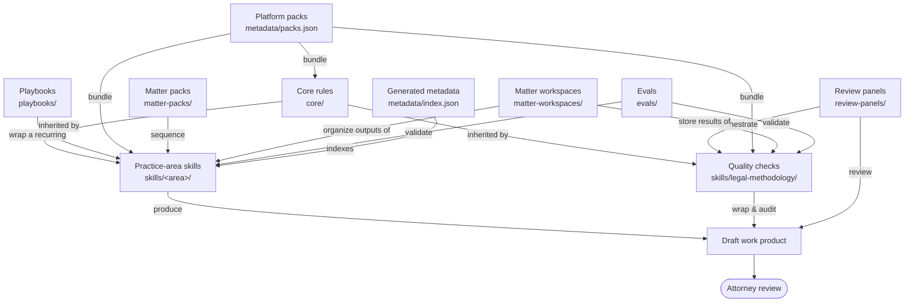

# Workflow Map

A static map of how AgentCounsel's components relate. The library is plain
Markdown; this page just shows how the pieces fit together. Everything below
ultimately produces **draft legal work product for attorney review** — never
legal advice.

For choosing a surface, see
[`CHOOSE_YOUR_WORKFLOW.md`](CHOOSE_YOUR_WORKFLOW.md). For maturity, see
[`PROJECT_STATUS.md`](PROJECT_STATUS.md).

## Map

## Relationships (text legend)

If the diagram above does not render, this is what it says:

- **Core rules -> skills and quality checks.** Every skill and every quality
  check inherits the operating rules in `core/`. They always apply.
- **Skills -> draft work product.** A practice-area skill is the primary unit
  that produces a draft deliverable.
- **Quality checks wrap skill outputs.** The legal-methodology checks run
  *after* a primary skill to audit its prose, citations, sources, assumptions,
  hallucination risk, privilege, and format. They improve reviewability; they do
  not verify legal correctness.
- **Playbooks wrap skills.** A playbook adds default questions, risk settings,
  required sources, and required quality checks around one recurring task type,
  anchored on an underlying skill.
- **Review panels orchestrate quality checks.** A panel sequences several review
  passes over a high-risk draft before the attorney gatekeeper. The passes are
  structured review passes, not autonomous agents and not lawyers.
- **Packs bundle skills + core + quality checks.** A platform pack assembles the
  relevant skills, core rules, and quality checks for a given platform; a matter
  pack sequences skills for a recurring matter type.
- **Matter workspaces organize outputs.** A workspace carries a matter's facts,
  sources, deadlines, and the drafts produced by every skill and quality check
  run within it, so context persists across steps.
- **Evals validate skills and metadata.** The eval system checks structure,
  routing, metadata, and safety signals — not legal substance.
- **Everything ends at attorney review.** The draft work product flows to a
  qualified, licensed attorney, who reviews and adopts it.

## Component map

| Component | Directory / file |
|---|---|
| Core rules | [`../core/`](../core/) |
| Practice-area skills | [`../skills/`](../skills/) |
| Quality checks | [`../skills/legal-methodology/`](../skills/legal-methodology/) |
| Platform packs | [`../metadata/packs.json`](../metadata/packs.json) |
| Matter packs | [`../matter-packs/`](../matter-packs/) |
| Matter workspaces | [`../matter-workspaces/`](../matter-workspaces/) |
| Playbooks | [`../playbooks/`](../playbooks/) |
| Review panels | [`../review-panels/`](../review-panels/) |
| Evals | [`../evals/`](../evals/) |
| Generated metadata | [`../metadata/index.json`](../metadata/index.json), [`../metadata/router.json`](../metadata/router.json), [`../metadata/packs.json`](../metadata/packs.json) |
| Workflow router | [`../WORKFLOW_ROUTER.md`](../WORKFLOW_ROUTER.md) |
